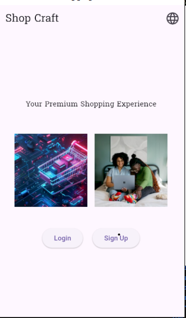
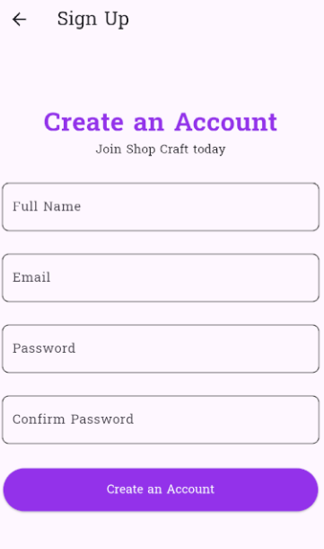
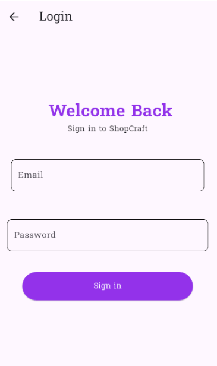
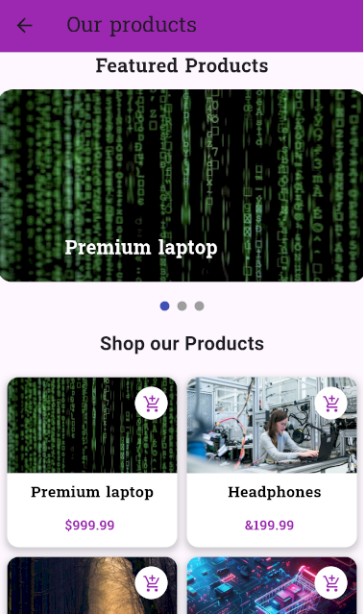

# shopping_app

A complete Flutter project simulating a real-world shopping application. The app includes user authentication, product display, cart interactions, animations, and localization (Arabic). This project takes you from Dart fundamentals to professional mobile app development with Flutter
## Getting Started

Project Overview

This project demonstrates how to build a shopping app step by step, applying both Dart programming concepts and Flutter development practices. It covers:

Dart fundamentals (variables, lists, maps, control flow, functions, OOP).

Flutter UI development with stateless and stateful widgets.

Form validation and user input handling.

Navigation, transitions, and animations.

Localization and Arabic language support.

GitHub publishing and best practices for clean code.
-------------------------------------------------------------
Tools & Technologies
Dart: Core programming and logic.
Flutter SDK: UI and mobile app development.
VS Code : IDE for development.
GitHub: Version control and project hosting.
Command Line Tools: For Flutter commands and setup.
--------------------------------------------------
Features
1. Aesthetic Welcome Screen

AppBar with app title.

Two images (local + online).

Custom font (Suwannaphum) with styled text.

Two navigation buttons: Sign Up | Sign In.

2. User Authentication

Sign Up

Full Name (first letter uppercase).

Email (must include @).

Password (min. 6 characters).

Confirm password validation.

Success snackbar → "Close" button → navigates to shopping screen.

Sign In

Email and password validation.

Success snackbar → "Close" button → navigates to shopping screen.

3. Smooth Transitions

Fade animations between pages (sign-up/sign-in → home).

4. Shopping Home Screen

AppBar titled "Our Products".

Horizontal PageView for featured products.

GridView with 2 products per row:

Product image, title, add-to-cart icon.

Snackbar on adding to cart.

Hot Offers section:

Vertical scroll with images + descriptions using ListView.builder.

5. Arabic Language Support (Bonus)

Full localization using .arb files and intl.

Example:

"Our Products" → "منتجاتنا".

"Hot Offers" → "العروض الساخنة".

Translated form labels and snackbars.

Setup Instructions

1- Clone the repository

git clone https://github.com/mariamesam720/shooping_app.git
cd flutter-shopping-app

2- Install dependencies

flutter pub get
Run the app
flutter run
----------------------------
### Screenshots  

#### Welcome Screen  
  

### Sign Up  
  

### log In  
  

### Shopping Home Screen  
 
 

